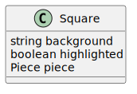
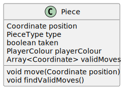
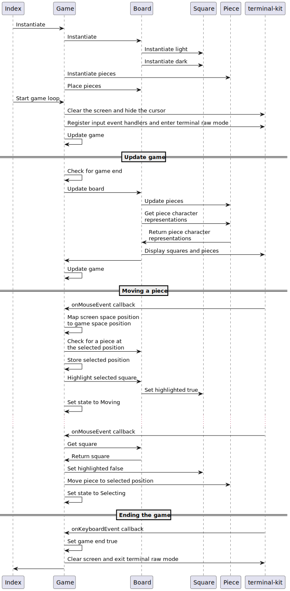

# Advanced programming assignment: Chess project
To play, run `npm install` for a first time run, and then `npm run dev`.

Alternatively run `npm install`, then `npm run build` 
to transpile from typescript to javascript in the `out` directory. 
Then you can run the program with `node out/index.js`.

## Challenge outline

### Problem summary, proposed solution
### Class diagrams

### Sequence diagram

### Decomposition into epics

## Development
### Good programming standards
TDD, typescript, descriptive names, re-usability.

### First slice development
For my first slice, I still wasn't decided on a technology for displaying my game, but I wanted to start building the components that would be 
required whichever tech I chose. I thought about using Ports & Adapters (or Hexagonal) architecture to keep the logic highly decoupled from the UI, 
as this would allow me to create internal functions that accept a callback to display with some injected UI adapter, and the game could be further developed 
in the future to use a different UI technology if I wanted to. Further into the project, I decided not to use ports and adapters as it was extra design and 
development work for advantages I wouldn't be able to take advantage of in getting marks for the project.

However, I still saw benefit in building from the bottom up, creating the common functionality like the Board and Piece classes to store an internal 
representation of the physical concepts that the UI would display. Using test driven development helped to ensure the methods on the classes worked as 
intended. Working from the bottom up meant I felt like I was further behind other students that had some visual output, as their current progress was 
a lot more tangible than mine.

The first thing I developed was a way to represent the board, it made sense to use arrays, but I initially used a one dimensional array which would be 
interpreted as wrapping round every 8 spaces. I thought that this would make accessing elements easier as there was no nesting and only one index to deal with,
and I wouldn't have to use lots of double nested for loops for iterating through the board. After developing some of the functions that would access the 
board array, I realised that I didn't gain much from this approach, and it would be easier to store the board as a 2D array as everything would be communicating
in cartesian xy coordinates, so the data structure might as well be made up of two components. I still wasn't super happy with writing lots of double for loops,
but I didn't think performance would be too much of an issue as dataset size could never grow and was fairly trivial, so I made a helper function to reduce 
repetition as this was the next main issue with the solution.

I also made specific types for the overall 2D array and the row arrays so that the typescript compiler help prevent an error with something being assigned to 
those arrays that shouldn't be. The row arrays hold a Square class that I made to hold the piece at that location, as well as some other information such as the 
background colour and whether the square was highlighted or not. Looking back this class could probably have just been an object type, as it doesn't have any
logic, only storage, but at the time I wasn't sure if there would be logic there in the future, so I made it class in preparation. There was a similar story 
behind the Coordinate type, which was originally a class until I decided that it being a class didn't bring any more value.

Next, I made an abstract Piece class which could store its position, it's colour, whether it had been taken, and an array to store valid moves that it 
could make that turn. While thinking about the fact that the Board stored the piece's positions as well as the piece's themselves, I wondered if I needed the 
board at all, and if I could just store the existing pieces ina single array in no particular order and let the UI functions assume that any location not used 
by a piece is empty. I was concerned about the search performance of this solution, as checking if a square is empty requires checking over the whole array 
of pieces, so I thought about just storing a marker for each piece in the board's arrays. The issue with this was about how to keep the board's marker 
representation in sync with the pieces' internal positions. Ultimately, I realised that this line of thinking was not worth it, as I gained nothing from the 
solution even if I could iron out the technical problems, and later down the line the slight asynchronicity of the piece's internal and external position 
representations proved to be helpful in detecting when a piece was taken.

Lastly, I wasn't sure about how typescript handled class inheritance, as I haven't encountered much OOP at work where I've learnt most of my typescript 
knowledge from, so I wanted to create a proof of concept to see if a child class could be stored in variable with the parent class's type. For this I made 
a simple DebugPiece class which inherited from the Piece class, then tried to store it in a fake board, which was of an array type expecting to store 
Piece objects and didn't reference the DebugPiece class. The test worked as there were no compilation errors pushing a new debug piece to the array, which 
gave me more confidence in my designed solution.

### Second slice development
Trying out some terminal UI libraries, first axel, then terminal-kit. Wanted to see a more concrete output of my program, to visualise the data 
representations.

### Final slice development
On the 17th December, with 4.5 days left, I felt like I wasn't going to finish my game with the originally planned features, 
so I decided to pivot and reduce the scope of the project. I wanted to produce a working, playable chess program, 
and I realised that I could achieve this without managing turns, enforcing rules around piece movements, and detecting check and checkmate.

When you play chess with a physical board, there is no enforcement of the rules other than the players knowing what they can and can't do. 
Therefore, if all my program provides is a board with the correct pieces in their stating positions that can be moved to a position and 
can take pieces they land on, then the game is technically playable. Any piece can be moved anywhere, and any oder of black and white pieces can be moved, 
but anyone wanting to play an actual game of chess would abide by the rules as there is no ore incentive to cheat than in real chess.

Certain special rules/moves would not be possible without extra work to put in specific logic, so en passant 
(where a pawn can take another pawn that has only moved its first turn as two squares, 
by taking the empty space behind it as if it had only moved one square) and pawn promotion
(where a pawn can turn into a queen if it reaches the other side of the board) are not in the scope of the MVP. 

En passant would require detecting a piece at a different location to where the pawn moved and removing it, and pawn promotion would require 
detecting a pawn at the opposite side of the board than it started and replacing it with a queen.

However, castling (where a king can move two/spaces towards one of its rooks, and the rook also moves to the other side of the king, 
so two piece are moved in one turn) is possible with no work require, as there is no restriction on the number of piece a player can
move on their turn, so they can move the king and then the rook then let the other player take their turn.

This new Minimum Viable Product would take much less work to reach than the original plan, all that was needed was to be able to move 
a piece to a location, to highlight the selected piece, and to ignore selecting an empty space to move from. 
Everything else was already completed as part of building from the bottom up, 
which means that this approach was effective in allowing me to be more flexible with my solution.

I decided to use a small 2-state machine for moving pieces, as the game could either be in a state of selecting a piece to move or 
selecting a position to move to. In the Selecting state, clicks on an empty state are ignored and clicks on a piece store that location into 
a private attribute, highlight the selected square and toggle the state. In the Moving state, on a click, the square at the stored location is un-highlighted, 
the piece at the stored location is moved to the clicked position and the state is toggled.

### Quality
As part of reducing the work needed to get a playable game, I decided not to do TDD for the Game class and the final features developed, in favour of
developing faster. There were some other features before this pivot that I didn't properly test or do TDD for, such as the board display function or
the update functions and game loop, as I couldn't work out how to mock the terminal-kit module to test the functions were called, I couldn't think of a way
to test the game loop and the logic in those functions was quite complex and state dependent. This maybe suggests that they should have been further broken
down into methods for each step. If were to continue working on this program as a hobby project, getting rid of this tech debt would be high on my backlog.

### Reflect on design challenges and solutions

## Evaluation

### Analysis with examples of refactors, reusability and code smells
### Effective use of advanced programming principles
### Improved algorithms
### Review, opportunities to improve and continued professional development