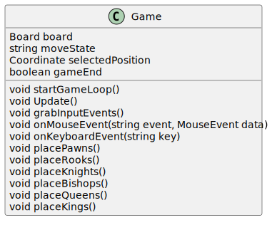
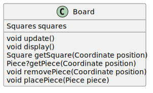
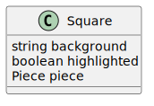
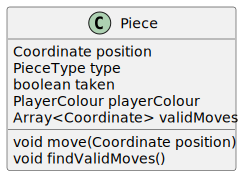
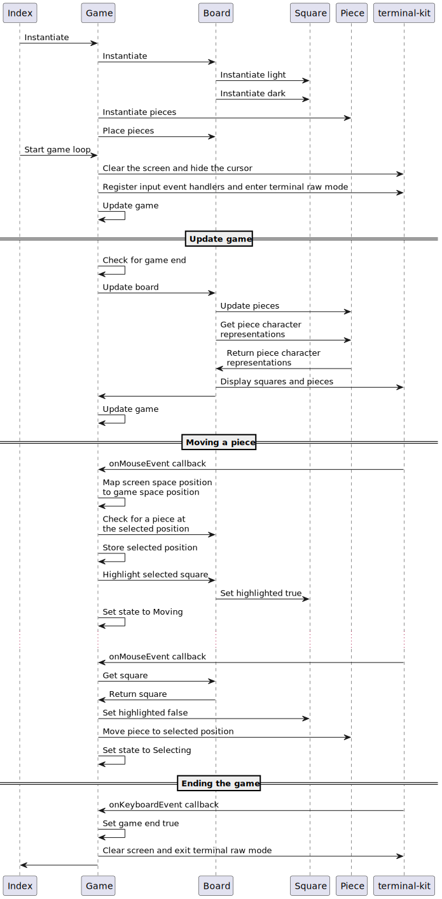
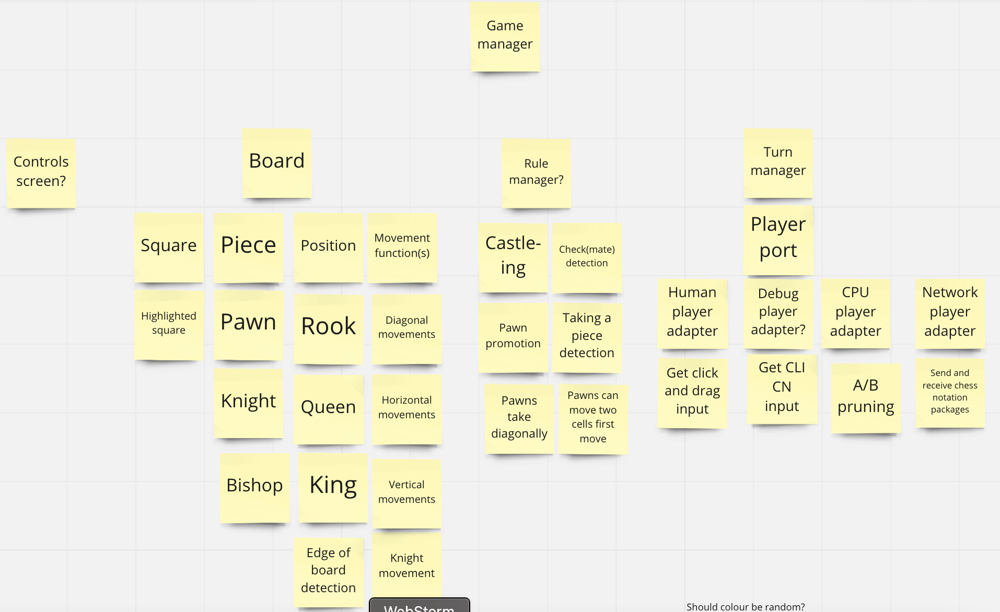
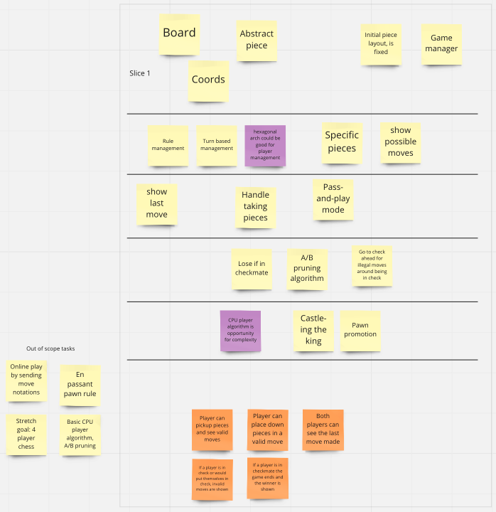
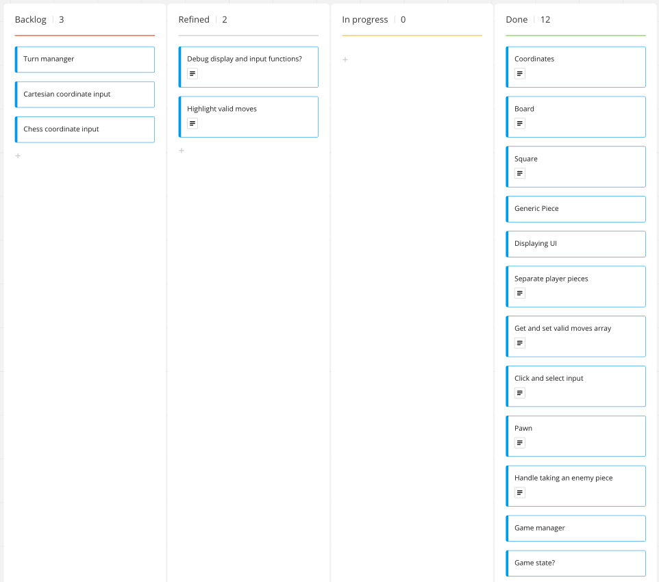
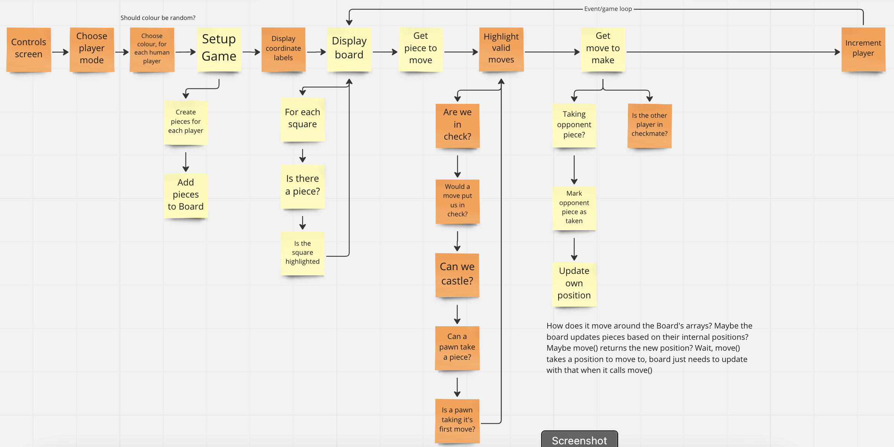

# Advanced programming assignment: Chess project
To play, run `npm install` for a first time run, and then `npm run dev`.

Alternatively run `npm install`, then `npm run build` 
to transpile from typescript to javascript in the `out` directory. 
Then you can run the program with `node out/index.js`.

Note: Replit.com seems to override the colours displayed in the terminal, which means that the white and black pieces are not coloured by which player 
they belong to, but by the background colour of the square they're on. This is incredibly annoying, but I believe it's out of my control.

## Challenge outline

### Problem summary, proposed solution
Problem definition: I am a bored software engineer, and I want to play chess with my colleague in my terminal.

I've done academic game projects before and have always found defining the problem being solved by a game program not easy. Beyond the statement of just 'I want to play a game', 
I think the definition should include some of the things that make this program unique from other games on the market, especially in this case as this is not a unique game idea 
that I've come up with, but a re-implementation of an existing game, and I think running in a terminal is a good USP to distinguish my project from all the other chess programs 
that exist (and from the other chess programs being made by students for this assignment). 

For this game, the proposed requirements are:
- Able to run in the terminal
- Mouse inputs
- Keyboard inputs
- Pass and play turns
- Show valid moves
- Show the last move made
- Show when a player is in check and show valid moves with this in consideration
- Show when a player is in checkmate

I had a few stretch goals including online multiplayer by sending chess notation moves to another connected chess client (potentially connecting with another student's chess 
program if we could coordinate and agree on a protocol/contract for what information to send and receive) and singleplayer vs a basic cpu player using an A/B pruning algorithm 
to decide which move is the most advantageous over several turns.

My proposed solution was to use OOP in typescript and a node library for handling terminal UI functionality. OOP is a paradigm that lends itself well to game development, as 
it's usually fairly intuitive to use classes to represent real world concepts in a program. For example, some obvious classes for a chess program are a Piece and a Board, and 
inheritance can be used for more specific pieces like a Pawn. 

I thought about using C++ as it has good OOP support and is typically used for games as its lower level control allows for better optimisation which helps with game performance, 
but performance isn't a huge concern as chess isn't a realtime application like most modern games. Instead, I chose typescript as I had more familiarity with it from using it 
at work, and I preferred the strict type system in TS to C++'s, as it includes features such as string literal types, union types, and type narrowing. These features make me 
feel like the type system is working for me, helping to prevent potential errors from setting variables to things they shouldn't be set to, instead of working against me and 
being difficult to work around. Javascript has OOP support, and typescript includes this by allowing classes as types for variables, but the support isn't as built-in and 
well-rounded as it is in C++, as there are limitations like not being able to define multiple constructors for overloading.

At the start of the project, I wasn't sure how I wanted to handle UI. I could have done it manually with console logging and some clever visual design choices, but I got inspired 
by the Adaship example project, which runs in the terminal but uses colour and extended unicode characters for some fancier UI. For most programs I'd written in the past, I didn't know
how to do a more refined command line UI, just a simple 'get input' & 'print string', so I wanted to do something more interactive and visually interesting & impressive. 

I started doing some research into node libraries for displaying UI in the terminal, and came across a few viable-looking options including axel, blessed and terminal-kit. Blessed 
seemed very powerful, providing a DOM-like API for creating a window & menu style UI inside the terminal using characters as pixels, but it seemed overcomplicated for the size of 
project I was producing. Axel was similar in that it uses the terminal as a canvas, but has a much lower level approach, providing functions for drawing lines, boxes, and pixels.
I started building a small proof of concept with axel to learn how it worked, but switched to terminal-kit when I started reading more about what it can do.

Terminal-kit differed from axel by providing full TUI (terminal UI) functionality, which includes getting input from user, whereas axel seemed to be designed only for displaying 
things on the screen. Blessed may have had similar input functions, but terminal-kit looked much simpler to use, and I found a series of tutorial blogs explaining the basics and the github
repo provided some example projects which I drew some insight from. I'll talk more about implementing my UI with terminal-kit in the development sections.

### Class diagrams

### Sequence diagram

### Decomposition into epics
While planning, I considered trying to a user story map to figure out what tasks are needed. I completed my interpretation/guesstimate of a user story map in a Miro board, but I 
haven't actually got much experience in doing user story maps and I had only just started reading the book in preparation for another upcoming hobby game project.

Along with this, I brain-dumped some tasks & classes then grouped them into slices to determine priorities for the tasks.

I created simple tickets from these tasks and classes, and refined them with notes and thoughts as I went through, using a kanban board in Miro with a refined 
column as a smaller, next-up backlog. Scrum sprints wouldn't really work for a project this short-running, so kanban style agile made more sense.

The main epics were:
- Board representation
- Game manager
- Movable pieces

Afterwards, I also created a crude flowchart to plan out the sequence of events, orange stickies are tasks that were later cut out of the MVP.

## Development

### Good programming standards
I wanted to do test driven development for this project as I highly value the confidence it gives my that my code works as expected, eve if I go back and refactor or change something elsewhere 
to work differently. This worked fine for the basic building block components like the Board, Square, and Piece classes as they had fairly simple inputs and outputs to their methods, which was a 
benefit of building bottom up, but when it came to creating a game loop and handling UI integrations I had to stop using TDD as I was forced to be more experimental to work out how terminal-kit 
worked and how I was going to have an update loop and I didn't know what outputs I was expecting or how to assert them.

I talked earlier about the benefits of typescript's type system, but they only add value if developers are strict with themselves about adding types on every member or variable, and I was quite 
strict with this as I recently saw a problem with some code at work where a fake data generator in a test wasn't using the type the implementation was using, and the generator was creating 
attributes which didn't exist on an object. Because of this, I tried to always keep types in mind when creating new attributes, methods and parameters, including creating a type for 
the data object passed as an argument to onMouseEvent(), and I kept these types mostly separate from their main usage so that if another file needed to reference the type it could import 
just the type definition instead of a whole unrelated class definition where it happened to first be used.

One of my key principals was to keep things agnostic, in that most functions shouldn't be aware of or dependent on other parts of the program. Functions being agnostic makes them less coupled, 
and easier to refactor, extend, etc. For example, I tried to restrict terminal-kit calls to certain areas of the code, only where it makes sense. Only display and input functions should be aware 
of terminal-kit, startGameLoop counts as display as it clears the screen on starting the program, Board.display(), Game.grabInputs(), and Game.onKeyboardEvent() are the only other functions 
that interact with it. Looking back I could have extracted the terminal-kit integrations in startGameLoop and onKeyboardEvent to a startUI and endUI function, so that those methods don't 
directly interact with terminal-kit, display and grabInputs make sense to be calling terminal-kit as that is there purpose, but initialising the terminal and input mode is a side effect of 
starting the game.

The final small thing I kept in mid throughout development, was sensible naming for members. From work, I've learnt that it's always better to have a long function name that describes 
exactly what it does than a short to type name that makes you have to open the function definition to understand what it does. Member names taking a long time to type should never be a problem 
as the IDE's autocomplete should make this trivial and is still less likely to get a typo in the name than manually writing out a short name. If the function or variable names are descriptive, 
then lines of code start to read like sentences and don't need as much messy commenting, because reading the line of code itself should describe what is happening. This makes renaming things 
one of the most important refactors, and again the IDE can sometimes help with refactoring all usages of a variable name at once to reduce typos.

### First slice development
For my first slice, I still wasn't decided on a technology for displaying my game, but I wanted to start building the components that would be 
required whichever tech I chose. I thought about using Ports & Adapters (or Hexagonal) architecture to keep the logic highly decoupled from the UI, 
as this would allow me to create internal functions that accept a callback to display with some injected UI adapter, and the game could be further developed 
in the future to use a different UI technology if I wanted to. Later into the project, I decided not to use ports and adapters as it was extra design and 
development work for advantages I wouldn't be able to take advantage of in getting marks for the project.

However, I still saw benefit in building from the bottom up, creating the common functionality like the Board and Piece classes to store an internal 
representation of the physical concepts that the UI would display. Using test driven development helped to ensure the methods on the classes worked as 
intended. Working from the bottom up meant I felt like I was further behind other students that had some visual output, as their current progress was 
a lot more tangible than mine.

The first thing I developed was a way to represent the board, it made sense to use arrays, but I initially used a one dimensional array which would be 
interpreted as wrapping round every 8 spaces. I thought that this would make accessing elements easier as there was no nesting and only one index to deal with,
and I wouldn't have to use lots of double nested for loops for iterating through the board. After developing some of the functions that would access the 
board array, I realised that I didn't gain much from this approach, and it would be easier to store the board as a 2D array as everything would be communicating
in cartesian xy coordinates, so the data structure might as well be made up of two components. I still wasn't super happy with writing lots of double for loops,
but I didn't think performance would be too much of an issue as dataset size could never grow and was fairly trivial, so I made a helper function to reduce 
repetition as this was the next main issue with the solution.

I also made specific types for the overall 2D array and the row arrays so that the typescript compiler help prevent an error with something being assigned to 
those arrays that shouldn't be. The row arrays hold a Square class that I made to hold the piece at that location, as well as some other information such as the 
background colour and whether the square was highlighted or not. Looking back this class could probably have just been an object type, as it doesn't have any
logic, only storage, but at the time I wasn't sure if there would be logic there in the future, so I made it class in preparation. There was a similar story 
behind the Coordinate type, which was originally a class until I decided that it being a class didn't bring any more value.

Next, I made an abstract Piece class which could store its position, it's colour, whether it had been taken, and an array to store valid moves that it 
could make that turn. While thinking about the fact that the Board stored the piece's positions as well as the piece's themselves, I wondered if I needed the 
board at all, and if I could just store the existing pieces ina single array in no particular order and let the UI functions assume that any location not used 
by a piece is empty. I was concerned about the search performance of this solution, as checking if a square is empty requires checking over the whole array 
of pieces, so I thought about just storing a marker for each piece in the board's arrays. The issue with this was about how to keep the board's marker 
representation in sync with the pieces' internal positions. Ultimately, I realised that this line of thinking was not worth it, as I gained nothing from the 
solution even if I could iron out the technical problems, and later down the line the slight asynchronicity of the piece's internal and external position 
representations proved to be helpful in detecting when a piece was taken.

Lastly, I wasn't sure about how typescript handled class inheritance, as I haven't encountered much OOP at work where I've learnt most of my typescript 
knowledge from, so I wanted to create a proof of concept to see if a child class could be stored in variable with the parent class's type. For this I made 
a simple DebugPiece class which inherited from the Piece class, then tried to store it in a fake board, which was of an array type expecting to store 
Piece objects and didn't reference the DebugPiece class. The test worked as there were no compilation errors pushing a new debug piece to the array, which 
gave me more confidence in my designed solution.

### Second slice development
For my second slice, I wanted to see a more concrete output of my program, to visualise the data representations, so I started researching terminal UI packages and how to use each one. 
Axel seemed like the simplest to use at first, with functions for drawing simple shapes to the terminal, so I did some experimentation to start drawing a board, but while doing this I
read about terminal-kit and how it could handle inputs as well as outputs. This seemed a lot more useful for my use case as I wanted to implement mouse controls, so I switched over to 
using terminal-kit and implemented the board's display function to draw a black and white checkerboard to the screen.

Then, I added logic to check if there was a piece at the square being drawn, and write its character representation instead of just an empty string, using the same background colour so 
that the square is still the right colour. This brought to light the issue of contrast, as black pieces were obviously not visible on top of a black background, and white pieces would have a
similar issue when I used the pieces colour attributes later on. For now the solution was to draw the foreground text in the opposite colour to tha background, but I continually re-evaluated 
the background colours throughout this and the next slice (where I'd also have to think about highlighted squares having good contrast with the surrounding squares as well as the piece on 
top of it), starting with green and grey, then moving to light blue and grey.

I already knew that my solution for moving a piece around the board worked, as I had tested it manually with some hardcoded calls to the move and update functions, and now I could see that the 
piece was moving to the correct position, so I wanted to start implementing input handlers. I started by creating a keyboard event handler for the ctrl-c key bind, to make sure I could still quit
the program if it crashed. Then, I created a mouse event handler to explore how terminal-kit treated mouse inputs. I discovered that it treats the top left corner of the terminal as (1, 1), but 
I wanted the coordinates to be more intuitive to someone used to graph coordinates, so my board starts from the bottom left corner at (0, 0). The squares on my board are also 3 characters wide 
to make it more square shaped, but terminal-kit gives the position in terms of characters along and down the screen. This meant I had to map the mouse position in the event to a position on my 
board, which involved dividing the x coordinate by 3 and discarding the remainder. In this slice, I just wanted to figure out how terminal-kit worked, so I was logging the event and the mapped 
position to the console to see if it was working properly, and I would use the mapped position to move a piece later on in the next slice.

### Final slice development
On the 17th December, with 4.5 days left, I felt like I wasn't going to finish my game with the originally planned features, 
so I decided to pivot and reduce the scope of the project. I wanted to produce a working, playable chess program, 
and I realised that I could achieve this without managing turns, enforcing rules around piece movements, and detecting check and checkmate.

When you play chess with a physical board, there is no enforcement of the rules other than the players knowing what they can and can't do. 
Therefore, if all my program provides is a board with the correct pieces in their stating positions that can be moved to a position and 
can take pieces they land on, then the game is technically playable. Any piece can be moved anywhere, and any oder of black and white pieces can be moved, 
but anyone wanting to play an actual game of chess would abide by the rules as there is no ore incentive to cheat than in real chess.

Certain special rules/moves would not be possible without extra work to put in specific logic, so en passant 
(where a pawn can take another pawn that has only moved its first turn as two squares, 
by taking the empty space behind it as if it had only moved one square) and pawn promotion
(where a pawn can turn into a queen if it reaches the other side of the board) are not in the scope of the MVP. 

En passant would require detecting a piece at a different location to where the pawn moved and removing it, and pawn promotion would require 
detecting a pawn at the opposite side of the board than it started and replacing it with a queen.

However, castling (where a king can move two/spaces towards one of its rooks, and the rook also moves to the other side of the king, 
so two piece are moved in one turn) is possible with no work require, as there is no restriction on the number of piece a player can
move on their turn, so they can move the king and then the rook then let the other player take their turn.

This new Minimum Viable Product would take much less work to reach than the original plan, all that was needed was to be able to move 
a piece to a location, to highlight the selected piece, and to ignore selecting an empty space to move from. 
Everything else was already completed as part of building from the bottom up, 
which means that this approach was effective in allowing me to be more flexible with my solution.

I decided to use a small 2-state machine for moving pieces, as the game could either be in a state of selecting a piece to move or 
selecting a position to move to. In the Selecting state, clicks on an empty state are ignored and clicks on a piece store that location into 
a private attribute, highlight the selected square and toggle the state. In the Moving state, on a click, the square at the stored location is un-highlighted, 
the piece at the stored location is moved to the clicked position and the state is toggled.

### Quality
As part of reducing the work needed to get a playable game, I decided not to do TDD for the Game class and the final features developed, in favour of
developing faster. There were some other features before this pivot that I didn't properly test or do TDD for, such as the board display function or
the update functions and game loop, as I couldn't work out how to mock the terminal-kit module to test the functions were called, I couldn't think of a way
to test the game loop and the logic in those functions was quite complex and state dependent. This maybe suggests that they should have been further broken
down into methods for each step. If were to continue working on this program as a hobby project, getting rid of this tech debt would be high on my backlog.

I wrote tests for the doubleFor helper function as it's quite critical and the callback pattern is a little unusual so there was a higher chance of getting something wrong

Wanted to do mutation testing but didn't think it was worth the time.

### Effective use of advanced programming principles
OOP, state machine, Observer variation with registering event listeners